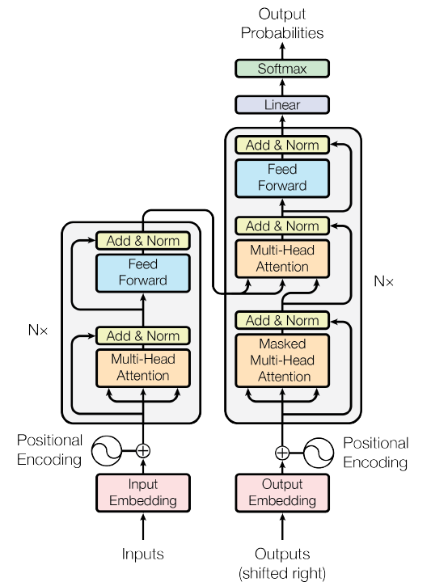
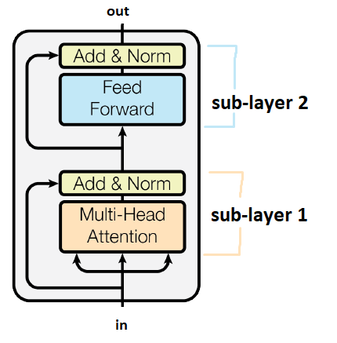
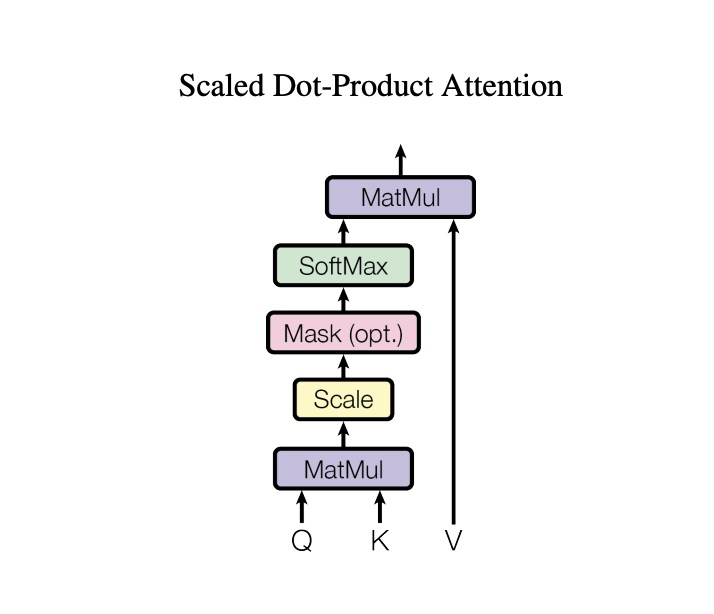
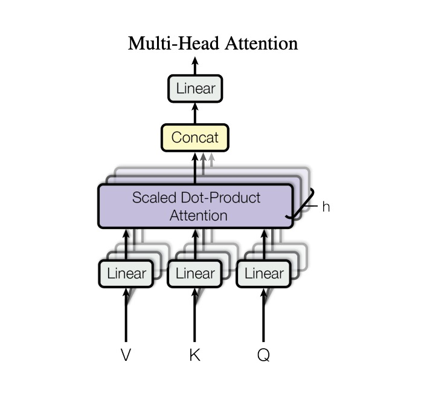
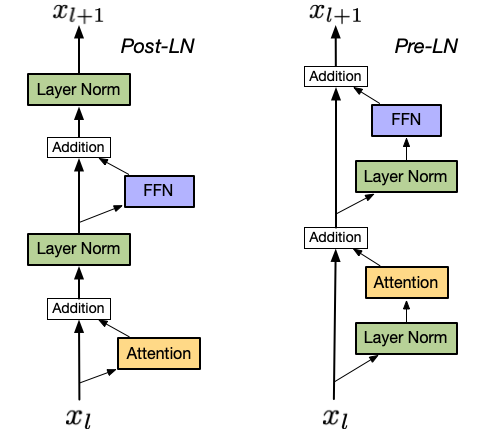

# Transformer

## Table of Contents
- [Backgrounds](#backgrounds)
- [Transformer Architecture](#transformer-architecture)
  - [Tokenization and Word Embedding](#tokenization-and-word-embedding)
    - [Tokenization](#tokenization)
    - [Word Embedding](#word-embedding)
  - [Positional Encoding](#positional-encoding)
  - [Encoders and Decoders](#encoders-and-decoders)
    - [Self-Attention](#self-attention)
    - [Query, Key, Value](#query-key-value)
    - [Scaled Dot Product](#scaled-dot-product)
    - [Multi-Head Attention](#multi-head-attention)
    - [Residual Connection](#residual-connection)
    - [Layer Normalization](#layer-normalization)
      - [PreLN vs. PostLN](#preln-vs-postln)
    - [Feedforward Network](#feedforward-network)
    - [Masked Multi-head Attention](#masked-multi-head-attention)
    - [Encoder-Decoder Attention](#encoder-decoder-attention)
  - [Training and Inferencing](#training-and-inferencing)
- [What's Next](#whats-next)
- [References](#references)

## Backgrounds
In the NLP field, traditional RNNs model the text sequences while suffering from the gradient vanishing and explosion issues. Like human memory, RNNs struggle to retain long-past information, focusing more on recent inputs. LSTM excels in long-term dependencies and alleviates gradient vanishing by its memory cell (forget/input/output gates). 

In 2017, Google's scientists proposed the transformer with its famous attention mechanism in the "Attention is All You Need" paper [1] (cited by 138,640), which became the SOTA deep learning framework widely used in NLP. 

## Transformer Architecture
The transformer architecture explains its transformative performance in NLP tasks.

### Tokenization and Word Embedding
Like other NLP models, the model can't understand the texts, hence we need numerical inputs. An intuitive way to convert text into numbers is by breaking sentences into segments, assigning each a numerical representation, and then concatenating them.

#### Tokenization
The first part of breaking sentences into multiple sections is tokenization. Huggingface has a [tokenizer summary](https://huggingface.co/docs/transformers/en/tokenizer_summary). 

**Word-based:** In general, splitting by words is simple, but the major problem is it creates a huge corpus (a set of all unique words). 

**Character-based:** But if we only break the sentences into characters, each single character contains little contextual meaning, although it reduces the corpus size greatly. For example, learning the meaning of "h" alone provides little context compared to learning "hello."

**Subword-based:** Since *word-based* and *character-based* have limitations, the transformer model uses *subword* tokenization, which is the hybrid between *word-based* and *character-based*. The principle is, the rarely used words should be split into smaller and meaningful subwords while the frequent words should be better kept. For example, "surprisingly" is used less frequently than "surprising" and "ly". It will be decomposed into "surprising" and "ly" and we can use "surprising" and "ly" to create "surprisingly" again.

Subword-based tokenizers include:
- Byte-Pair Encoding (BPE) [2], used in GPT-2, RoBERTa, etc.
- WordPiece [3], used in BERT, DistilBERT, and Electra, etc.
- Unigram [4], initialize a large vocabulary and then narrow it down.

Note that these methods are based on a pre-tokenizer, which is to firstly separate words by spaces, and then apply subword tokenizer. However, some languages such as Chinese and Japanese, do not use spaces to separate words within sentences.

- Therefore, SentencePiece [5], a language-independent subword tokenizer was proposed, making it easier for multilingual tasks.

You can use [tiktoken](https://github.com/openai/tiktoken) package to check the tokenization of OpenAI's models.

#### Word Embedding
After separating the long text sequences into tokens (to sync with the generally used term "word embedding", in the following sections we will also use "word"), the next process to vectorize these text tokens is word embedding. There are many word embedding techniques. 

**One-Hot:** One-hot embedding is straightforward. If the vocabulary has 10k different words, each word will become a 10k-dimension vector. All other elements are "0" except for a single element which is a "1". The dimension of the embedded vectors highly depends on the vocab size and each vector is sparse and huge.

**Bag of Words:** Bag of words is to model texts by counting the word frequency. It indeed makes the vectors denser. But the shortcoming is losing semantic meanings if only counting the number of words.

**Word Embeddings:** To create dense and smaller word representations, while maintaining the semantic meanings, methods like Word2Vec [6] and GloVe [7] are often used. Word2Vec trains embeddings with CBOW (continuous bag of words) and Skip-gram. To put it simply, the embeddings are trained by predicting a token with its surrounding tokens, and by predicting its surrounding tokens with a specific token.

### Positional Encoding
With word embedding, each word now has its own numerical representation.

In natural language, words' relative orders carry information. For example, in the sentence "My cat eats fish" and "My fish eats cat", the positions of "*cat*" and "*fish*" determine the sentence meanings.

In traditional RNNs, as the model processes the input word vectors sequentially, using the same word embedding for the same word works. E.g. in both of the 2 sentences, cat: [0.1, 0.2, -0.1], fish: [-0.1, -0.2, 0.1], regardless of the positions.

But in the transformer, as the model processes each word in parallel for efficiency, using word embeddings alone fails to capture relative orders. Therefore, the authors proposed positional encoding with 2 options: One is to learn the embeddings, which means trainable parameters are required; Another one is to directly use some heuristics like sinusoidal. They found similar performances of these options. Finally, they chose a set of sinusoidal functions to encode positions without adding additional parameters, reducing computational cost.

### Encoders and Decoders
With word embedding and positional encoding, the transformer model can understand each word and its relative order now. Before diving into self-attention, it is worth mentioning that the transformer architecture has 2 main sections, the encoders and the decoders. On a high level, the encoders are to understand the context and the decoders are to generate predictions. Moreover, stacking only encoders yields models like BERT (Bidirectional encoder representations from transformers [8]), focused on understanding context, while stacking decoders creates autoregressive models like GPT (Generative Pre-trained Transformer) for text generation.

Let's start from the architecture of Encoders, aka. encoder layers.

### Self-Attention
After the input text is vectorized and attached with positional information, how does the model understand the relation of words? This is where the self-attention mechanism works. 
In the sentence "My name is Ana." The word "*name*" is more relevant to "*Ana*" than to "*is*". Failing to capture the information causes information loss. 
The transformer architecture leverages the attention mechanism to solve this problem. In encoders, it is **self-attention**, in decoders, it is **masked self-attention** and between encoders and decoders, it is **encoder-decoder attention**. You will see the word "*multi-head*" a lot. We will discuss it later.

#### Query, Key, Value
For each token (word embedding + positional encoding now), the architecture will generate **query**, **key** and **value** (Q, K, V) with linear transformations using 3 sets of matrices. Note, here, the **query**, **key** and **value** are generated vectors using the encoded inputs and the mentioned matrices. Suppose we have an English to Chinese machine translation task and the English Sequence is "I love apples.", in the self-attention mechanism, we will have 3 query vectors for "I", "love", and "apples" respectively and 3 key vectors for these 3 words too. Then to get the similarity/relevance between "**I**" and every other word, including itself, we need to calculate the [**Dot Product**](https://en.wikipedia.org/wiki/Dot_product) of the **query** of "**I**" and the **key** of "**I**", "**love**" and "**apples**" respectively. Then a softmax will be applied to these 3 values and generate 3 new softmax outputs. We then multiply the **value** vector with the softmax output and create a new vector, which is the *self-attention values for "I"*.

As we pointed out, the transformer processes words in parallel, which means the *key, query, and values of "**I**", "**love**" and "**apples**" will be created at the same time regardless of word order*. To enable this, the weights used for **query** are the same across words, as are **key** and **value**. 

#### Scaled Dot Product
We mentioned Dot Product above. But the paper actually uses scaled dot product. When the input dimension gets larger, the value created from query * key will also be large. So after [softmax](https://en.wikipedia.org/wiki/Softmax_function), some self-attention values are large, while others are close to 0. If we don't scale the Q*K output, we might have gradient vanishing/explosion issues and the training will not be stable. Scaling stabilizes the training and avoids saturating the softmax output.

#### Multi-Head Attention
In the transformer model, the authors proposed a stack of self-attention cells (eight heads initially). Each cell has its own sets of weights for query, key, and value. This allows each independent head to focus on a different aspect of the input information, thus capturing complex meanings.

To control computational cost in multi-head attention, dimensions are reduced in each head. If head = 8, and the original model dimension is 512, each head dimension is set to dk = dv = d_model/h = 64. The MHA outputs are then concatenated, ensuring the final output dimension matches the original input.

### Residual Connection
Let's return to the encoder layers:

Following multi-head attention, residual connections and normalization are introduced. To mitigate the vanishing gradient problem and enable efficient training of deeper networks, transformer architecture allows self-attention layers to connect to the word embedding & position encoding input, forming residual (or skip) connections popularized by ResNet [9].

### Layer Normalization
In deep learning, normalization is a widely used technique to reduce overfitting. Normalizing activation inputs ensures values are centered around zero, enabling faster and more stable training.

In computer vision, batch normalization is common because image inputs share the same shape. However, each NLP input can have different numbers of tokens or sizes, and token variations are substantial across sentences. Using batch normalization across dimensions is impractical, so layer normalization, which normalizes across all features (dimensions) in a training example, is preferred.

#### PreLN vs. PostLN

In practice, there are 2 ways to add layer normalization (LN). 
-  PostLN (left): places LN after the residual block, normalizing the feedforward network residual as well, which is more robust.
-  PreLN (right): places LN inside the residual block, normalizing fewer parameters, which helps prevent gradient explosion/vanishing.

For deep networks, pre-norm is better, while post-norm works well for shallower models. 

### Feedforward Network
The last part of an encoder layer is the feedforward network, consisting of linear layers with activation functions like ReLU.

Now we have covered the encoder structure. Encoders and decoders have similar normalization and feedforward networks, so here we focus only on different components.

### Masked Multi-head Attention
Looking at the architecture, the right tower (decoders) is different.

We have defined Multi-head, but what is masked? Masked Self-Attention (MSA) calculates relevance/similarity between each word, including itself and preceding words. MSA is used instead of Self-Attention because the decoder is designed to translate (in the English-to-Chinese example). Predicting the next token relies on preceding tokens, so masking prevents data leakage during training and aids in autoregressive generation. For further detail, refer to [text generation strategies](https://huggingface.co/blog/how-to-generate) used to predict the next token.

### Encoder-decoder Attention
As noted, encoders learn context while decoders create new tokens. Encoder-decoder Attention connects encoders and decoders, letting the decoder selectively focus on significant words in the input. For example, in translating "I love apples" to "我爱苹果," the query for "我" is used to calculate dot products with each key in the encoded "I love apples," yielding encoder-decoder attention values. This layer uses a distinct set of weight matrices from self-attention to focus selectively on significant words from the encoder output.

### Training and Inferencing
During training, each token’s output from a layer computation can be processed in parallel in the subsequent layer. Since we already have the target sequence (like having the label to predict), in the decoder, masked self-attention can also be calculated in parallel.
During inference, the decoder relies on previously generated tokens, so it can't be fully parallelized, resulting in slower processing times.

## What's Next
This is a summary of the transformer architecture. In the next posts, we will discuss BERT, knowledge distillation, and various multi-modal models.

## References
[1]: https://user.phil.hhu.de/~cwurm/wp-content/uploads/2020/01/7181-attention-is-all-you-need.pdf  
[2]: https://arxiv.org/pdf/1508.07909  
[3]: https://static.googleusercontent.com/media/research.google.com/ja//pubs/archive/37842.pdf  
[4]: https://arxiv.org/pdf/1804.10959  
[5]: https://arxiv.org/pdf/1808.06226  
[6]: https://arxiv.org/pdf/1301.3781  
[7]: https://aclanthology.org/D14-1162.pdf  
[8]: https://arxiv.org/pdf/1810.04805  
[9]: https://arxiv.org/pdf/1512.03385  
Self-Attention Video: https://www.youtube.com/watch?v=zxQyTK8quyY&t=3s  
